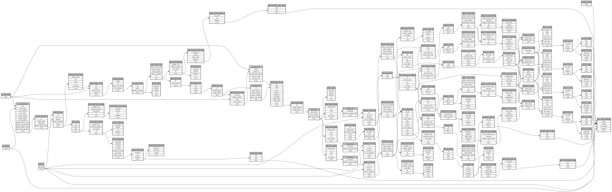

```
# AUTOGENERATED BY ECOSCOPE-WORKFLOWS; see fingerprint in README.md for details

```

```yaml
# fingerprint:
artifacts_sha256_basic: afc8d36c7ac9644e49aa324bb9523a247584a18b95f657ff11d931b254dcc15a
artifacts_sha256_strict: d101aef350ad9270e2c8abb7c97620da0040f95458285ffb26e0e7293c4f7b37
installed_requirements:
- channel: https://repo.prefix.dev/ecoscope-workflows/
  name: ecoscope-platform
  version: {version: ==2.15.1}
- channel: https://repo.prefix.dev/ecoscope-workflows-custom/
  name: ecoscope-workflows-ext-custom
  version: {version: ==0.1.0rc14}
- channel: https://repo.prefix.dev/ecoscope-workflows-custom/
  name: ecoscope-workflows-ext-ste
  version: {version: ==0.0.0rc1}
- channel: https://repo.prefix.dev/ecoscope-workflows-custom/
  name: ecoscope-workflows-ext-wwf-virunga
  version: {version: ==0.0.0rc9}
- channel: https://repo.prefix.dev/ecoscope-workflows-custom/
  name: ecoscope-workflows-ext-big-life
  version: {version: ==1.0.1}
- channel: https://repo.prefix.dev/ecoscope-workflows-custom/
  name: ecoscope-workflows-ext-mnc
  version: {version: ==1.0.2}
- channel: conda-forge
  name: pydeck
  version: {version: ==0.9.2}
- channel: conda-forge
  name: opentelemetry-sdk
  version: {version: ==1.44.0}
params_sha256: 8ec66f689124f09fdc0b9e58fd0668d6d6a9a023df19834cdf059202d17289b4
spec_sha256: 212eb87ed653e235db45e417191ee2c6640dd3d464534f4b076a9a4088610026

```

# ecoscope-workflows-mnc-patrol-effort-workflow


